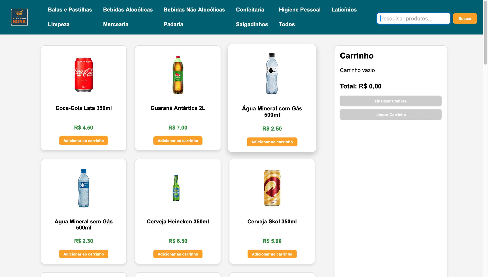
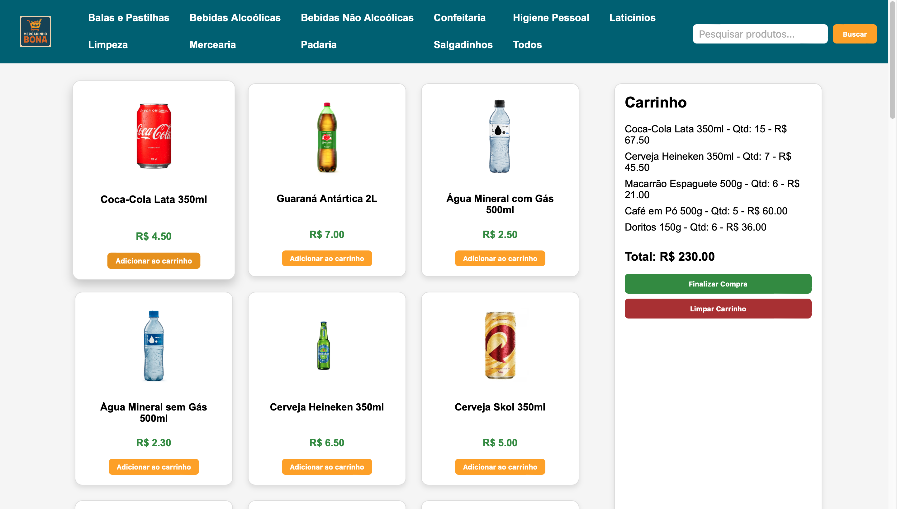
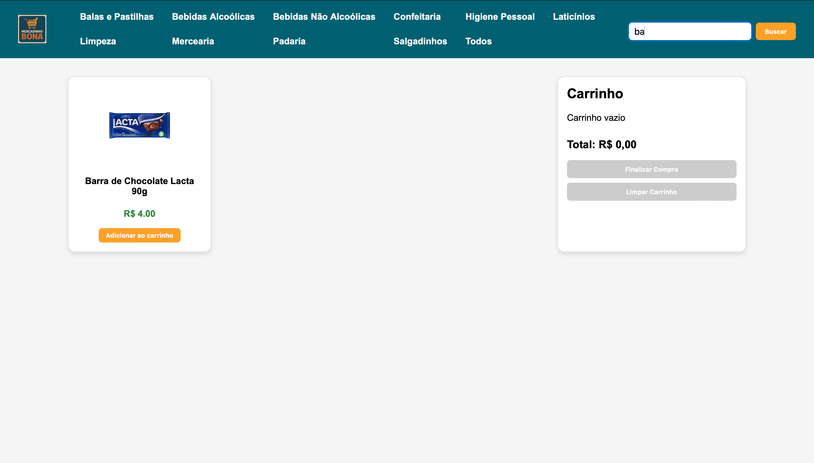

# MercadinhoBona

Uma loja virtual simples feita com HTML, CSS e JavaScript, com funcionalidades essenciais de e-commerce como listagem de produtos, busca, categorias, carrinho e controle de estoque.

---

## Descrição

Este projeto simula um pequeno mercado online. Os usuários podem navegar pelos produtos, filtrá-los por categoria, pesquisar pelo nome, adicionar itens ao carrinho, visualizar o total e finalizar a compra. O estoque é respeitado e controlado dinamicamente.

---

## Funcionalidades

- Exibição de produtos em formato de cards  
- Filtro por categorias  
- Campo de busca por nome de produto  
- Carrinho de compras com total dinâmico  
- Controle de estoque: impede adicionar produtos acima do estoque disponível  
- Alerta ao tentar adicionar produto esgotado  
- Finalizar compra (reseta carrinho e estoque)  
- Layout responsivo  

---

## Tecnologias Utilizadas

- **HTML5**  
- **CSS3**  
- **JavaScript**

---

## Como executar o projeto

1. **Download do Projeto**  
   Você pode baixar o projeto completo pronto para usar neste link:  

   [Download ZIP do ProjetoFinal](https://github.com/ArthurBona/Devs2Blu_Arthur/releases/download/v1.0/ProjetoFinal.zip)  

2. **Executar o projeto**  
   - Descompacte o arquivo `ProjetoFinal.zip` em uma pasta de sua preferência.  
   - Abra o arquivo `index.html` em seu navegador (basta dar duplo clique).

---

## Imagens das telas

Tela inicial do MercadinhoBona:

Visualização do carrinho de compras em atividade:

Barra de busca em funcionamento:

Limite de quantidade sendo atingido:

